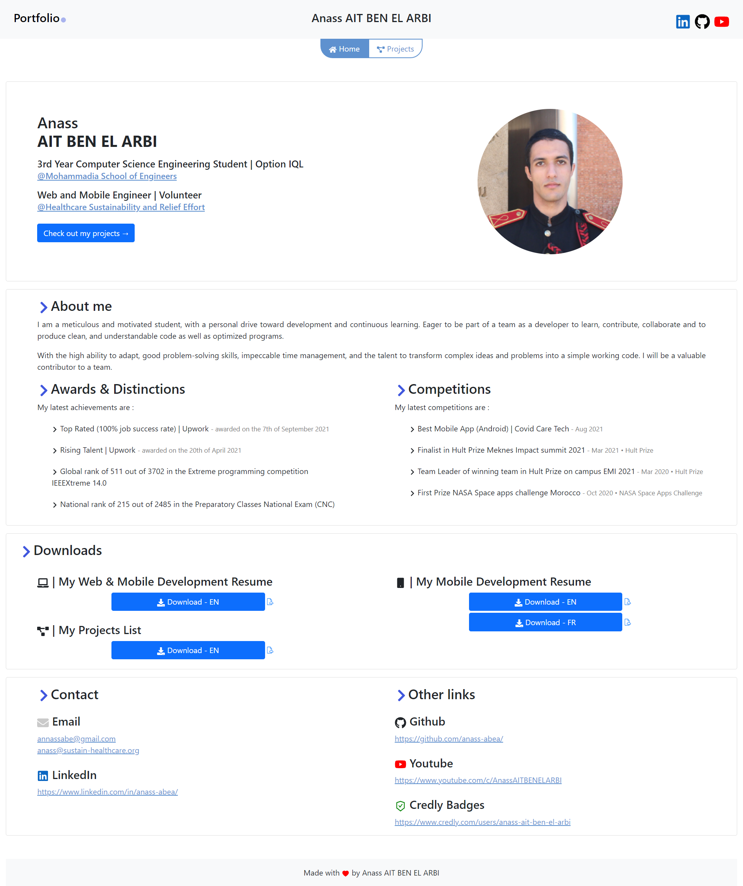
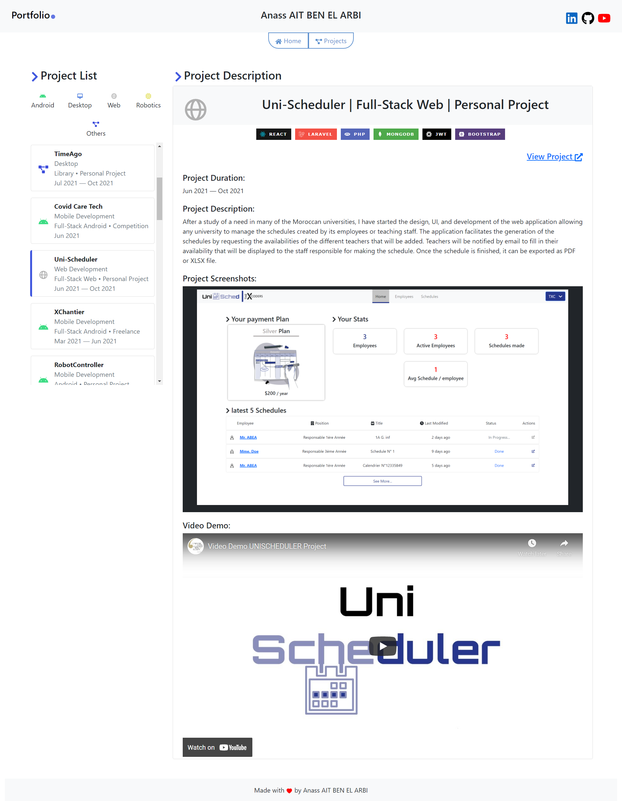

# Free React Front-End Portfolio Template

Portfolio with two pages : Home and Projects. 
Home page will display the person's data, awards, achievements and others and the Projectsf page will contain all the varieties of projects the person worked on.

## Screenshot


| Home Page |   |   Projects  |  
|:----:|---|:------:|
|      |   |  |  

## Download

To download the code you can:
- click the green button on top right corner and then download ZIP 

- open your command line and execute 
```
git clone https://github.com/Anass-ABEA/react-portfolio-template.git
```

## Changes
These are the changes you need to make:

### Manifest

in `public/manifest.json` change the `name` property of the json file

The existing value is:
```
"name": "Portfolio | Anass AIT BEN EL ARBI",
```

### Image
in `public` change the `me.jpg` image with a square image of yourself. if you don't have a square image you can use [This website](https://croppola.com/).

make sure to keep the name `me.jpg` or change it in the code `src/content/pages/HomePage/HomePage.js:20`

### HomePage content

Most of the content in the home page needs to be modified since it's pure text

### ProjectData

in `src/content/pages/Projects/ProjectData.js`, you'll find all the data related to your projects. 
There is a var `Tags` that contains all the tags prepared for you to be called with quickly.

The main element to change is the variable `data`. you can remove the example project and add your own.

The constructor of the `SingleProject` class has 7 parameters.

1. Project title
2. Project Type 
3. Project Technology
4. Project Context
5. Project description
    - The description can be either text or Html code, for example it can be like the provided example or `<div><h2>Hello world!</h2> <span>Test Code</span></div>`
6. Project Start Date
7. Project end Date

The start and end date can be formatted only using the month and year like 
```
new Date("2021-06")
```

The class setters are made like the Builder Design pattern. Every class returns `this`
- You can add Images to the the image Carusel directly by changing the value of the array `_images` or by using the function buildImages that builds the image path using the prefix and the start and number of images you have added in `public/images/[YOUR_PREFIX]` (you can check out the example)
- You can set a video using the videoURL property or using one of the provided methods. More details in the comment above each method (Don't forget to add your images to the folder with the same name as the one provided in the `prefix` and renaming your images to Picture1.jpg, Picture2.jpg, ....).
- You can set a URL for your project that will Open in a new window 
- You can add tags using the function `setTags()` that takes as a parameter an array with the Tags that are specified right above the data variable. 


### Header
In `src/content/components/Header.js:14` You can change the name inside the `h4` tag.


    


